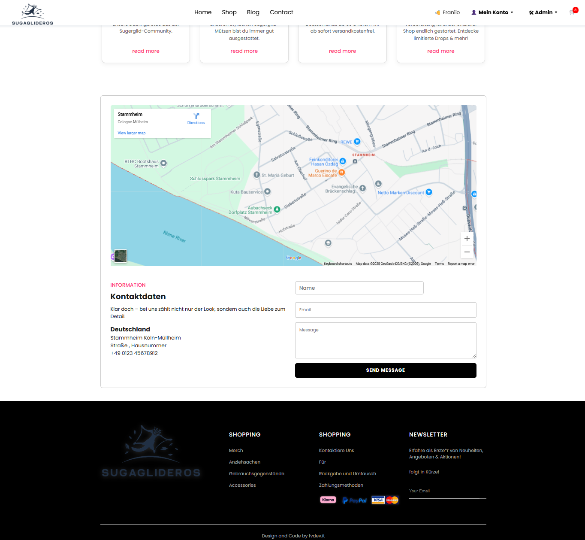

# 🎉 E-Commerce Plattform SG

---

## 1. Projektübersicht

**🎨 Projektname:**  
E-Commerce SG

**🛠️ Anwendungstyp:**  
Fullstack E-Commerce Webanwendung

**🧰 Technologie-Stack:**  
- **Frontend:** React (Vite)  
- **Backend & Datenhaltung:** Firebase (Firestore, Auth, Storage)  
- **Zahlungssysteme:** Stripe, PayPal, Klarna  
- **E-Mail-Service:** EmailJS  
- **Styling:** CSS

**🔍 Projektbeschreibung:**  
_E-Commerce SG_ ist eine vollständig funktionsfähige E-Commerce-Plattform, die den gesamten Verkaufsprozess digital abbildet – von der Produktverwaltung über den Warenkorb und Checkout bis hin zur Zahlungsabwicklung und Nutzerverwaltung.  
Die Anwendung ist modular aufgebaut, responsiv gestaltet und eignet sich ideal als Portfolio-Projekt oder technisches Fundament für reale E-Commerce-Lösungen.

---

## 2. Funktionen & Features

### 🛍️ Kundenseite

- **Produktkatalog:**
  - Übersichtliche Anzeige aller Produkte mit Bildern, Farben, Größen und Preisen
  - Produktfilterung nach Kategorien, Farben und Verfügbarkeit
  - Detailansicht mit Produktbeschreibung, Verfügbarkeit und Variantenwahl (Größe, Farbe)

- **Warenkorb:**
  - Hinzufügen, Ändern und Entfernen von Produkten mit Varianten (Farbe, Größe)
  - Echtzeit-Update und Synchronisation bei eingeloggten Nutzern
  - Zwischensumme, Versandkostenberechnung und Gesamtpreis

- **Checkout & Bestellprozess:**
  - Eingabe von Liefer- und optional abweichender Rechnungsadresse
  - Automatische PLZ-basierte Stadtauswahl
  - Auswahl verschiedener Zahlungsarten: PayPal, Stripe (Kreditkarte), Klarna, Nachnahme
  - Lagerbestandsprüfung vor Bestellung, automatische Aktualisierung des Bestands
  - Übersichtliche Bestellübersicht und Bestätigungsmail via EmailJS

- **Nutzerkonto:**
  - Registrierung, Login, Passwort anzeigen / zurücksetzen
  - Verwaltung von Adressen (Liefer- und Rechnungsadressen)
  - Anzeige der Bestellhistorie mit Details zu jeder Bestellung

- **Responsives Design:** Optimiert für Desktop, Tablet und Smartphone

### 🛠️ Admin-Dashboard

- **Produktverwaltung:**
  - Erstellen, Bearbeiten, Löschen von Produkten
  - Pflege von Varianten (Farben, Größen) und Lagerbeständen
  - Hochladen und Verwalten von Bildern pro Farbe
  - Automatische Statusänderung zu „ausverkauft“ bei leerem Lager

- **Import & Export:**
  - JSON-basierte Produkt-Daten-Backup und Importfunktion
  - Vorschau vor dem Import

- **Bestellübersicht:**
  - Übersicht aller eingegangenen Bestellungen
  - Sortierung nach Datum, Filterung nach Status

- **Benutzerverwaltung:**
  - Einsehen und Verwalten von Nutzerrollen (Admin, Kunde)

- **Live-Daten:** Echtzeit-Updates dank Firestore onSnapshot

---

## 3. Technologie-Stack

| Bereich              | Technologie/Tool            | Beschreibung                                 |
| -------------------- | --------------------------- | -------------------------------------------- |
| Frontend             | React (Vite)                | Moderne UI-Bibliothek mit schnellem Bundling |
| Styling              | CSS / CSS Modules           | Gestaltung und Layout                        |
| Authentifizierung    | Firebase Authentication     | Nutzeranmeldung und Autorisierung            |
| Datenbank            | Firebase Firestore          | NoSQL-Datenbank für Produkte, Nutzer, Orders |
| Storage              | Firebase Storage            | Speicherung von Bildern und Assets           |
| Zahlungsabwicklung   | Stripe                      | Kreditkartenzahlungen via Payment Intents    |
| Zahlungsabwicklung   | PayPal                      | PayPal Checkout Integration                  |
| Zahlungsabwicklung   | Klarna                      | Rechnungskauf & Sofortüberweisung            |
| E-Mail Versand       | EmailJS                     | Versand von Bestellbestätigungen             |
| Backend Stripe API   | Node.js Server              | Erstellung von Payment Intents               |
| Hosting & Deployment | Vercel / Netlify (optional) | Deployment des Frontends und Backends        |

---

## 4. Projektstruktur

```plaintext
frontend/
├── public/               # Statische Dateien & Assets
├── src/
│   ├── Pages/            # React Seiten (Shop, Checkout, Profile, Admin)
│   ├── components/       # Wiederverwendbare UI-Komponenten
│   ├── contexts/         # Auth & Cart Contexts
│   ├── firebase/         # Firebase Konfiguration
│   ├── hooks/            # Custom React Hooks
│   ├── scripts/          # Hilfsskripte (Produktimport, Lagerupdate)
│   └── css/              # Stylesheets
├── stripe-server/        # Express Backend für Stripe
├── App.jsx               # Haupt-App Komponente
├── main.jsx              # Einstiegspunkt
└── vite.config.js        # Vite Konfiguration
```

---

## 5. Installation & Setup

### Voraussetzungen

- Node.js (≥16) & npm  
- Firebase Projekt mit Firestore, Auth und Storage  
- Stripe Developer Account & API-Schlüssel  
- PayPal Sandbox- oder Live-Konto  
- EmailJS Account mit Service- und Template-ID  

### Quickstart

```bash
git clone https://github.com/Fvdev-it/E-Commerce-SG.git
cd E-Commerce-SG/frontend
npm install
npm run dev
```

### Umgebungsvariablen

Das Projekt nutzt zwei `.env`-Dateien:

1. `frontend/.env`  
2. `stripe-server/.env`

### Firebase-Projekt anlegen

- Firestore, Authentication, Storage aktivieren  
- API Keys und Konfigurationsdaten bereithalten  
- Eintragen der API Keys in `src/firebase/firebaseConfig.js`

### EmailJS konfigurieren

- Beispiel-Template: `frontend/template.txt`  
- In `src/Page/Checkout.jsx`:
  - Zeile 20: `emailjs.init("DEIN PUBLIC KEY");`
  - Zeile 290: `await emailjs.send("SERVICE_ID", "TEMPLATE ID", {...});`

### Stripe Backend starten

```bash
cd ../stripe-server
npm install
node src/stripe-server/server.js
# oder
node server.js
```

---

## 6. Sicherheit & Rollen

### Firestore-Regeln

Regeln befinden sich in:  
`frontend/Rules.txt`

- Nur authentifizierte Nutzer haben Zugriff auf eigene Daten  
- Admins können Produkte, Bestellungen und Nutzer vollständig verwalten  
- Sicherheitsregeln schützen sensible Daten vor unberechtigtem Zugriff  
- Lagerbestände werden vor Bestellabschluss validiert  

---

## 7. Ausblick & Erweiterungen

- ✅ Unterstützung mehrerer Bilder pro Produktvariante  
- 🔜 Produktbewertungen und Kommentare  
- 🔜 Admin-Benachrichtigungen per E-Mail  
- 🔜 Analytics zum Lagerbestand  
- 🔜 Mobile-optimierte Benutzeroberfläche  
- 🔜 Rabattsysteme und Gutscheine  
- 🔜 Mehrsprachigkeit (i18n)  
- 🔜 CMS-Anbindung zur Produktpflege  
- 🔜 PWA-Unterstützung (Offline-Modus)

---

## 8. Screenshots

_Hinweis: Die Screenshots befinden sich im Ordner `/screenshots/` im Hauptverzeichnis und können bei Bedarf direkt im README eingebunden werden._
### Admin-Bereich

  
  
  
  


---

### Kundenbereich

  
  
  


---

### Checkout & Bestellung

  
  
  
  


---

### Nutzerprofil & Bestellungen

  


---

## 9. Lizenz

Dieses Projekt ist ausschließlich für Portfolio- & Lernzwecke freigegeben.  
Kein produktiver Einsatz ohne Lizenzklärung mit dem Entwickler.

---

## 10. Kontakt

Fragen, Feedback oder Interesse am Code?  
**[folgt]**

---

## 11. Systemarchitektur

```plaintext
[Client (React)]
     ↓ API Calls
[Firebase Auth] ←→ [Firebase Firestore]
     ↓                   ↑
[Stripe Webhook]    [EmailJS]
     ↓
[Stripe Server (Node.js)]
```

**Kurzbeschreibung:**  
Die Anwendung basiert auf einer client-zentrierten Architektur mit Firebase als Echtzeit-Datenbank und Authentifizierungsdienst.  
Zahlungsdaten werden über einen Node.js-Stripe-Server abgesichert verarbeitet. E-Mails werden asynchron via EmailJS versendet.

---

## 12. Tests & Qualitätssicherung

### 🔍 Manuelle Tests

- Mobile, Tablet, Desktop: Chrome, Safari, Firefox
- Checkout-Flow mit Stripe-Testkarten und PayPal Sandbox
- Responsives Verhalten bei verschiedenen Bildschirmgrößen

### ⚙️ Optional: Automatisierte Tests

> Noch nicht implementiert, aber vorbereitet:
- Jest + React Testing Library
- Cypress für End-to-End-Tests

---

## 13. CI/CD & Deployment

- **CI-Tool:** GitHub Actions (Build & Deploy via Vercel oder Netlify)
- **Build Pipeline:** Lint → Build → Deploy
- **Secrets Handling:** API Keys über `.env` + GitHub Secrets (nicht im Repo enthalten)

---

## 14. React + Vite

This template provides a minimal setup to get React working in Vite with HMR and some ESLint rules.

Currently, two official plugins are available:

- [@vitejs/plugin-react](https://github.com/vitejs/vite-plugin-react/blob/main/packages/plugin-react) uses [Babel](https://babeljs.io/) for Fast Refresh  
- [@vitejs/plugin-react-swc](https://github.com/vitejs/vite-plugin-react/blob/main/packages/plugin-react-swc) uses [SWC](https://swc.rs/) for Fast Refresh  

### Expanding the ESLint configuration

If you are developing a production application, we recommend using TypeScript with type-aware lint rules enabled. Check out the [TS template](https://github.com/vitejs/vite/tree/main/packages/create-vite/template-react-ts) for information on how to integrate TypeScript and [`typescript-eslint`](https://typescript-eslint.io) in your project.
